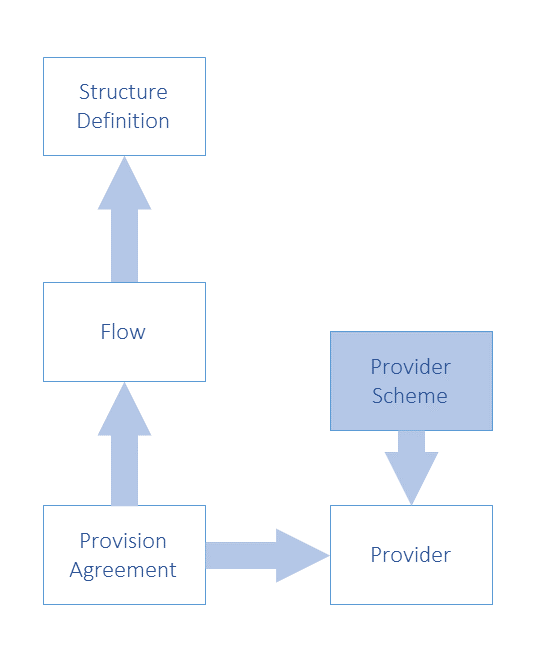
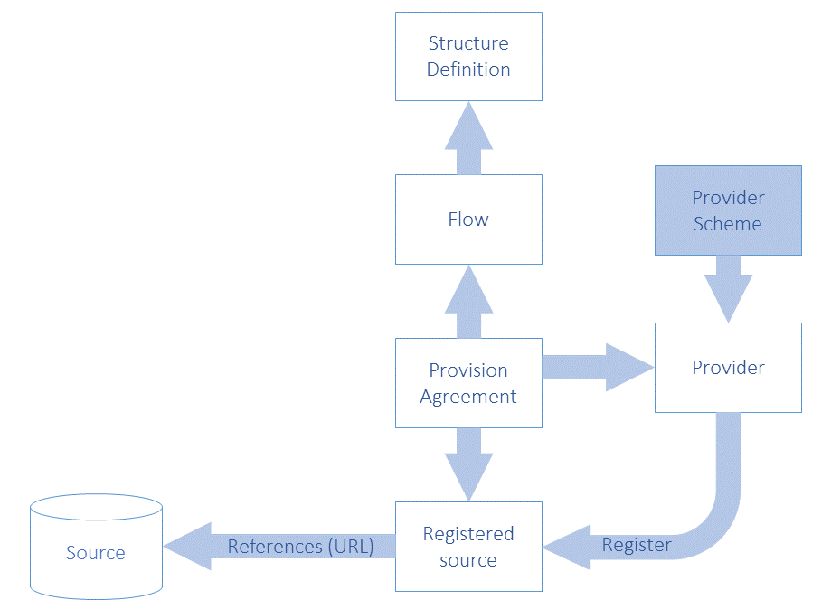
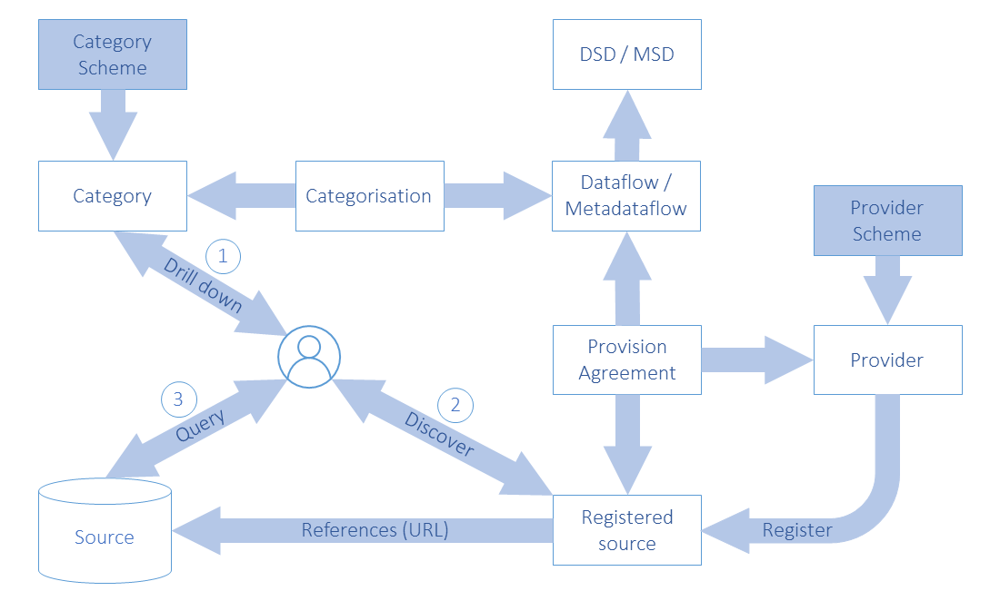

# 3 Scope of the SDMX Registry/Repository

## 3.1 Objective

The objective of the SDMX registry/repository is, in broad terms, to
allow organisations to publish statistical data and reference metadata
in known formats such that interested third parties can discover these
data and interpret them accurately and correctly. The mechanism for
doing this is twofold:

1.  To maintain and publish structural metadata that describes the
    structure and valid content of data and reference metadata sources
    such as databases, metadata repositories, data sets, metadata sets.
    This structural metadata enables software applications to understand
    and to interpret the data and reference metadata in these sources.

2.  To enable applications, organisations, and individuals to share and
    to discover data and reference metadata. This facilitates data and
    reference metadata dissemination by implementing the data sharing
    vision of SDMX.

## 3.2 Structural Metadata 

Setting up structural metadata and the exchange context (referred to as
“data provisioning”) involves the following steps for maintenance
agencies:

-   agreeing and creating a specification of the structure of the data
    (called a Data Structure Definition or DSD in this document but also
    known as “key family”), which defines the dimensions, measures and
    attributes of a dataset and their valid value set;

-   if required, defining a subset or view of a DSD which allows some
    restriction of content called a “dataflow definition”;

-   agreeing and creating a specification of the structure of reference
    metadata (Metadata Structure Definition) which defines the metadata
    attributes and their presentational arrangement in a Metadataset or
    as part of a Dataset, and their valid values and content;

-   if required, defining a subset or view of an MSD which allows some
    restriction of content called a “metadataflow”;

-   defining which subject matter domains (specified as a Category
    Scheme) are related to the Dataflow and Metadataflow to enable
    browsing;

-   defining one or more lists of Data and Metadata Providers;

-   defining which Data/Metadata Providers have agreed to publish a
    given Dataflow/Metadataflow – this is called a Provision Agreement
    or Metadata Provision Agreement, respectively.

Figure 1: Schematic of the Basic Structural Artefacts in the SDMX-IM

Note that in Figure 1 (but also most of the relevant subsequent figures)
terms that include both data and metadata have been used. For example:

-   Structure Definition: refers to Data Structure Definition (DSD) and
    Metadata Structure Definition (MSD)

-   Flow: refers to Dataflow and Metadataflow

-   Provision Agreement: refers to Provision Agreement (for data) and
    Metadata Provision Agreement

-   Provider Scheme: refers to Data Provider Scheme and Metadata
    Provider Scheme

-   Provider: refers to Data Provider and Metadata Provider

In that context, the term “Metadata” refers to reference metadata.

## 3.3 Registration

Publishing the data and reference metadata involves the following steps
for a Data/Metadata Provider:

-   making the reference metadata and data available in SDMX-ML/JSON
    conformant data files or databases (which respond to an SDMX query
    with data). The data and reference metadata files or databases must
    be web accessible, and must conform to an agreed Dataflow or
    Metadataflow (Data Structure Definition or Metadata Structure
    Definition subset);

-   registering the existence of published reference metadata and data
    files or databases with one or more SDMX registries.

Figure 2: Schematic of Registered Data and Metadata Sources in the
SDMX-IM

## 3.4 Notification

Notifying interested parties of newly published or re-published data,
reference metadata or changes in structural metadata involves:

-   registry support of a subscription-based notification service which
    sends an email or notifies an HTTP address announcing all published
    data that meets the criteria contained in the subscription request.

## 3.5 Discovery

Discovering published data and reference metadata involves interaction
with the registry to fulfil the following logical steps that would be
carried out by a user interacting with a service that itself interacts
with the registry and an SDMX-enabled data or reference metadata
resource:

-   optionally browsing a subject matter domain category scheme to find
    Dataflows (and hence Data Structure Definitions) and Metadataflows
    which structure the type of data and/or reference metadata being
    sought;

-   build a query, in terms of the selected Data Structure Definition or
    Metadata Structure Definition, which specifies what data are
    required and submitting this to a service that can query an SDMX
    registry which will return a list of (URLs of) data and reference
    metadata files and databases which satisfy the query;

-   processing the query result set and retrieving data and/or reference
    metadata from the supplied URLs.

Figure 3: Schematic of Data and Metadata Discovery and Query in the
SDMX-IM