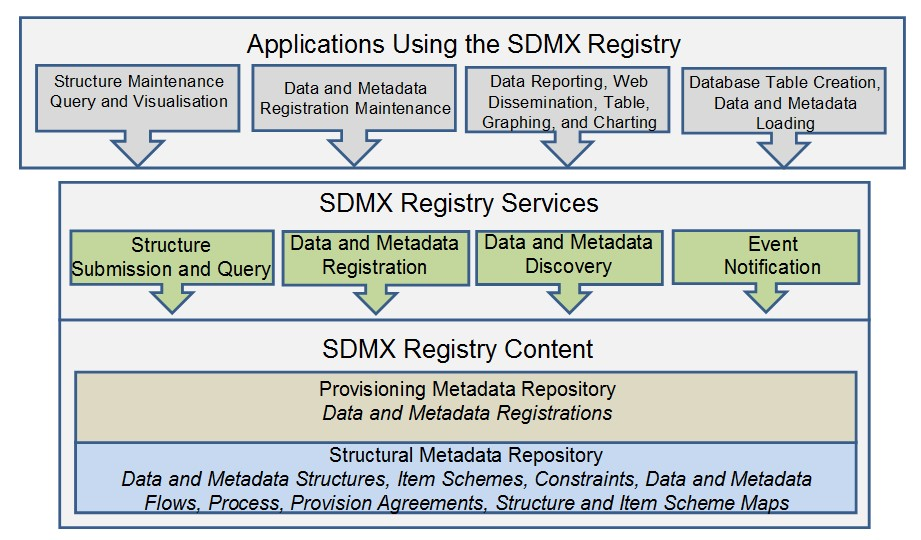

# 4 SDMX Registry/Repository Architecture

## 4.1 Architectural Schematic

The architecture of the SDMX registry/repository is derived from the
objectives stated above. It is a layered architecture that is founded by
a structural metadata repository which supports a provisioning metadata
repository which supports the registry services. These are all supported
by the SDMX-ML schemas. Applications can be built on top of these
services which support the reporting, storage, retrieval, and
dissemination aspects of the statistical lifecycle as well as the
maintenance of the structural metadata required to drive these
applications.

///  figure-caption | 4
Schematic of the Registry Content and Services
///

## 4.2 Structural Metadata Repository

The basic layer is that of a structural metadata service which supports
the lifecycle of SDMX structural metadata artefacts such as Maintenance
Agencies, Data Structure Definitions, Metadata Structure Definitions,
Provision Agreements, Processes etc. This layer is supported by the
Structure Submission and Query Service.

Note that the SDMX REST API supports all of the SDMX structural
artefacts. The only structural artefacts that are not yet supported are:

- Registration of data and metadata sources
- Subscription and Notification

As of the initial version of SDMX 3.0 no messages are defined to support
these artefacts; hence, users may need to use SDMX 2.1 Registry
Interface messages, instead.

## 4.3 Provisioning Metadata Repository

The function of this repository is to support the definition of the
structural metadata that describes the various types of data-store which
model SDMX-conformant databases or files, and to link to these data
sources. These links can be specified for a data/metadata provider, for
a specific data or metadata flow. In the SDMX model this is called the
Provision or Metadata Provision Agreement.

This layer is supported by the Data and Metadata Registration Service.